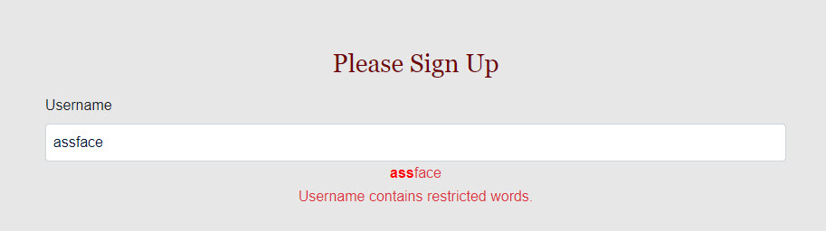

# Banned Word and Pattern Service

Getting Angular's custom validation to play nicely has always been a chore, so I usually handle it through a service.  Simple to modify and use however you like.  

**Trigger warning** - The service comes preloaded with a banned word list. It was surprisingly hard to find one online so I left it in place to save others the time.  

Hope it helps.
